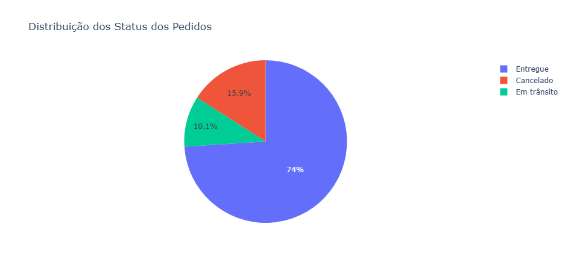
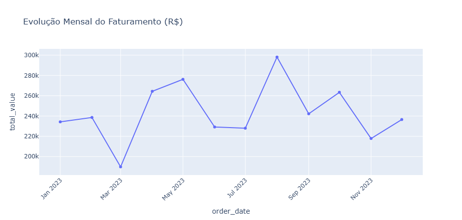
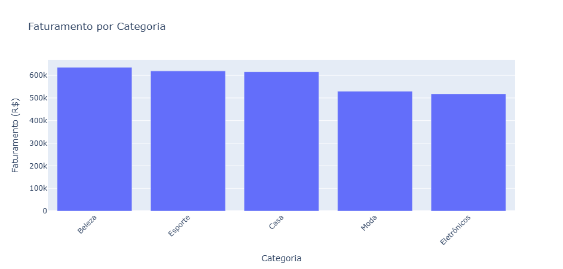
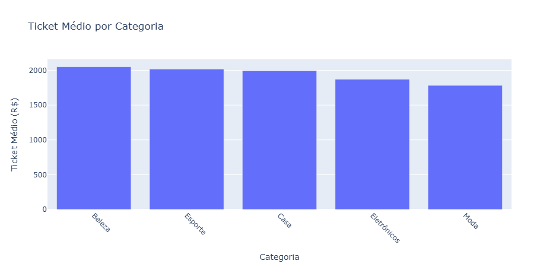

# 📊 Análise de Dados — E-commerce

Este projeto realiza uma **análise exploratória e estratégica de dados de um e-commerce**, utilizando Python para extrair insights relevantes que auxiliam na tomada de decisão.

Aqui você encontra análises de vendas, faturamento por categoria, ticket médio e mais — com gráficos que destacam os principais resultados.

---

## 🚀 Visualizações Principais

### 📌 Distribuição de Status dos Pedidos

Uma visão da eficiência logística e entrega dos pedidos:



---

### 📈 Evolução Mensal do Faturamento

Tendências de vendas ao longo do tempo, mês a mês:



---

### 💰 Faturamento por Categoria

Identificação das categorias que mais geram receita:



---

### 💵 Ticket Médio por Categoria

Comparativo do ticket médio entre segmentos:



---

## 🎯 Objetivos da Análise

- **Comportamento de Vendas:** Entender o fluxo de pedidos e faturamento  
- **Rentabilidade:** Identificar as categorias mais rentáveis  
- **Ticket Médio:** Avaliar o gasto médio por pedido  
- **Sazonalidade:** Observar variações ao longo do tempo  
- **Eficiência Operacional:** Analisar os status dos pedidos  

---

## 🛠️ Tecnologias e Ferramentas

- **Python 3.x**
- **Pandas & NumPy**
- **Plotly / Matplotlib**
- **Jupyter Notebook**

---

## 🗂️ Estrutura do Projeto

```text
📁 ANALISE_ECOMMERCE
│
├── 📓 analise_base.ipynb
├── 📓 analise_final.ipynb
├── 📄 ecommerce.csv
├── 📄 requirements.txt
├── 🖼️ distribuicao_status_pedidos.png
├── 🖼️ evolucao_mensal_faturamento.png
├── 🖼️ faturamento_categoria.png
├── 🖼️ ticket_medio_categoria.png
└── 📄 README.md
```

## 📝 Processo de Análise

## 1️⃣ Preparação dos Dados (analise_base.ipynb)
Leitura e inspeção dos dados

Limpeza de valores nulos

Conversão de formatos e padronização

## 2️⃣ Geração de Insights (analise_final.ipynb)
Cálculo de KPIs

Análises agregadas por categoria

Visualizações e interpretação de resultados

## 💡 Principais Insights

Algumas categorias apresentam grande faturamento mesmo com ticket médio menor

O ticket médio varia entre segmentos, indicando diferentes perfis de consumo

O faturamento apresenta variação ao longo do tempo

A maior parte dos pedidos foi entregue com sucesso

## 📦 Como Executar

```bash
Copiar código
pip install -r requirements.txt
```

Em seguida, execute os notebooks na ordem:

analise_base.ipynb

analise_final.ipynb

## 👤 Autor

Carlos Jaquis
